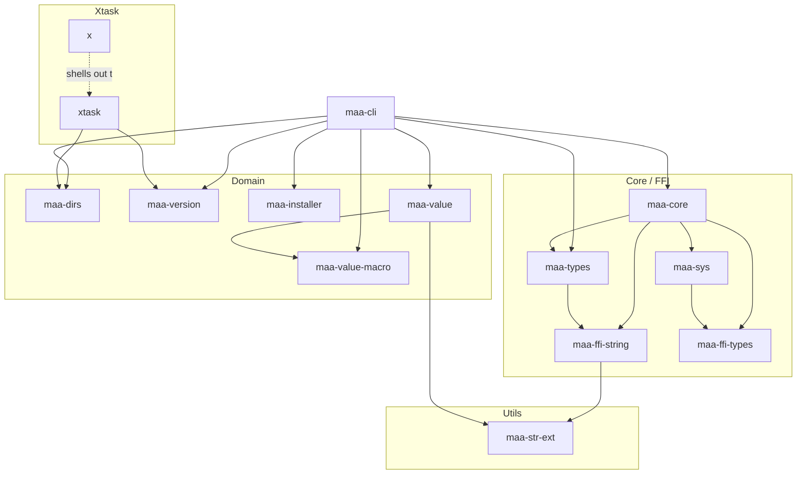

# maa-cli 开发文档

## 许可证

本项目采用 AGPL-3.0-only 许可证。您的所有贡献都将被纳入本项目，并遵循相同的许可证。

## 贡献指南

### 贡献流程

1. **Fork 本仓库**：在 GitHub 上 fork 本项目到你的个人账户。

2. **创建分支**：从主分支（`main` 或 `master`）拉取最新代码，并基于此创建分支（如 `feature/xxx`、`fix/xxx`）。

3. **开发与提交**：按照[代码规范](#代码规范)进行开发，确保代码格式、质量和测试覆盖率达标。建议每次提交前运行 `cargo +nightly fmt` 和 `cargo clippy`。

4. **推送分支并发起 PR**：将你的分支推送到 fork 仓库，并发起 Pull Request（PR）。PR 标题和描述需遵循 [Conventional Commits](https://www.conventionalcommits.org/zh-hans/) 规范，简明扼要说明变更内容和动机，并在 PR 中关联相关 Issue。

5. **代码评审与修改**：项目维护者会尽快进行代码评审，并提出修改建议。

6. **合并与发布**：通过评审后，PR 会以 squash 方式合并，你的贡献将被记录在 Change Log 中。

### 注意事项

- 避免直接向主分支提交代码，始终通过 PR 进行贡献。
- 提交 PR 前，确保自己的分支已经与主分支同步，避免合并冲突。
- 对于较大或影响范围广的变更，建议先在 Issue 中充分讨论方案。
- 如对现有代码有任何疑问，可以在 Issue 中提出，以获得帮助和反馈。
- 欢迎任何形式的贡献，包括文档、测试、CI 配置等。

## 开发环境

### 环境要求

- **Rust 工具链**：需要 1.84 版本或更高。推荐使用 [rustup](https://rustup.rs/) 安装。
  - 安装 nightly 版本的 `rustfmt`：`rustup component add rustfmt --toolchain nightly`
- **C 编译器**：如需在 Linux 上从源码编译 OpenSSL，或启用 `git2` 功能（默认启用）时需要。建议关闭 `git2` 功能以避免依赖 C 编译器和额外的 OpenSSL 库。待 gix 完全替代 git2 后，将移除该依赖。

### 构建项目

```bash
# 调试构建
cargo build

# 发布构建
cargo build --release

# 构建特定 crate
cargo build -p maa-cli
```

### 运行测试

```bash
# 运行所有测试
cargo test

# 运行特定 crate 的测试
cargo test -p maa-cli

# 运行特定测试
cargo test <测试名称>
```

## 发布流程

`main` 是发布源码分支。Stable 的发布意图由 PR 的 `release` 标签表示：同仓库的 PR 带此标签合入 `main` 才会发布。普通 PR 可以单独更新 Cargo 版本；修改 `Cargo.toml` 本身不会触发发布。

### 选择版本

`Prepare Stable Release` 和预发布的 `Release` 都接受 `version` 输入：

- `auto`（默认）：优先沿用 Cargo 中高于最近正式 tag 的待发布版本，否则由 git-cliff 推导。
- `patch`、`minor`、`major`：由 git-cliff 相对最近正式 tag 计算指定级别的版本。
- `X.Y.Z`：直接指定稳定版本号，必须高于最近正式 tag；预发布不接受在这里输入 `beta.N`。

自动推导只有 `fix`、`feat` 或 breaking change 会触发新版本：`fix` 推进 patch，`feat` 推进 minor，breaking change 在 `0.x` 阶段推进 minor。文档、重构等其他变更仍可出现在 changelog 中，但不单独触发自动 bump；需要发布时可以显式选择版本。

### Stable

1. 在 Actions 中从 `main` 运行 `Prepare Stable Release`，选择版本。
2. git-cliff 生成并 prepend changelog，Cargo 更新 lockfile；工作流创建或更新 `release-prep/vX.Y.Z` PR，并添加 `release` 标签。如果版本已通过普通 PR 更新，本次 PR 可以只修改 changelog。
3. 批准自动创建 PR 的 workflow runs，检查普通 CI 和 `Release Readiness`。准备后若 main 有新变更，重新运行 Prepare 刷新 PR；版本选择变化时应关闭旧的准备 PR，避免误合并。
4. 合并带 `release` 标签的 PR。工作流使用实际合并 commit 和已确认的 Cargo 版本，在创建任何 tag 前检查一次最终候选 changelog，然后保存发布计划和说明。
5. 编译并保存打包产物，创建正式 tag 和 GitHub Release，再由独立 job 更新 `version` 分支。Stable tag、Homebrew、AUR 和 WinGet 的后续任务在索引更新成功后运行。

准备检查仅针对 release PR；普通 CI 不承担版本推导或 changelog 一致性检查。最终合并校验若发现过期内容，会在发布前停止；即使 Cargo 版本已合入，也可以重新运行 Prepare 创建修复 changelog 的 release PR。

### Beta 和 Nightly

Beta 在 Actions 中从 `main` 手动运行 `Release`，选择 `channel=beta`，设置基础版本，并在真正发布时勾选 `publish`。默认不勾选，仅构建预览。Nightly 每日自动运行，也可以选择 `channel=alpha` 手动运行。

基础版本不变时 Beta 编号递增，例如 `0.8.0-beta.2` → `0.8.0-beta.3`；基础版本变化时从 `beta.1` 开始。相同 commit 和基础版本已经发布过该通道时跳过。预发布通过 `MAA_VERSION` 注入编译，不修改 main 的 `Cargo.toml`、`Cargo.lock` 或 `CHANGELOG.md`，也不需要版本 PR。

Beta 发布后更新 `version` 分支的 `beta.json`、`alpha.json` 及对应 `.txt`；Nightly 只更新 alpha；Stable 更新三个通道。若 Beta tag 或已发布的 Nightly 超前于索引，先恢复前一次发布的索引 job，再分配新编号。Alpha 分配前会通过 GitHub API 核对 Nightly 的版本和 tag commit；已有 Nightly 无法读取时也会停止，本地运行需提供已认证的 `gh`。

### 重试与验证

同一次 workflow run 的版本、commit 和发布说明保存为 `release-plan` artifact，打包结果和索引清单保存为 `release-bundle` artifact。重跑全部 jobs 或只重跑失败 jobs 都复用已保存的内容，不重新分配版本或改写已生成的产物。版本索引更新失败时，重跑 `Update Version Index` 及其失败的后续任务即可，不需要重新编译。

这些 artifacts 保留 90 天；过期时工作流停止，不能把重新推导和编译当作原发布的重试。不要提前删除恢复所需的 artifacts。正式 tag 已存在时必须指向同一 commit；旧 run 不能覆盖更新的通道版本。

Homebrew、AUR 和 WinGet 在每次发布任务执行时重新读取 stable 索引，核对版本和 commit；新版已经发布后，旧任务重试会失败并停止写入。手动运行这些下游工作流也只允许发布当前 stable 版本；Homebrew 和 AUR 的 dry-run 仍可预览其他版本。

`Prepare Stable Release` 使用内置 `GITHUB_TOKEN`，以 `github-actions[bot]` 身份创建 PR。仓库需要在 Settings → Actions → General 中启用 `Allow GitHub Actions to create and approve pull requests`。具有 write 权限的维护者批准 PR 的 workflow runs 后，检查才会运行。合并操作应由维护者完成，不使用 `GITHUB_TOKEN` 自动合并，否则不会产生所需的后续发布事件。

修改发布工具后运行 `cargo test -p xtask`、`cargo clippy -p xtask --all-targets -- -D warnings`、`bash .github/scripts/test-release-files.sh` 和 `bash .github/scripts/test-release-recovery.sh`。文件集成测试需要先 `cargo build -p xtask`，并在 PATH 中提供 git-cliff 2.13.1、git、Cargo、jq 和 Perl；测试只操作临时仓库。

## Workspace 架构

### 分层概览



### 各 crate 的职责

- `maa-cli`：最终的 CLI 应用，负责命令解析、任务编排、配置加载、安装更新入口，以及把各个库拼装成面向用户的行为。
- `maa-core`：MaaCore 的安全 Rust 封装，提供 `Assistant`、错误类型和 callback 抽象。
- `maa-sys`：MaaCore 的原始 FFI bindings，只负责暴露 C API 和链接行为，不提供高层接口。
- `maa-types`：共享类型定义层，包含任务类型、客户端类型、消息类型、Option key 等可被 CLI 和封装层共同使用的枚举与基础类型。
- `maa-ffi-types`：最底层的 FFI primitive aliases，如 `AsstBool`、`AsstId`、`AsstSize` 等。
- `maa-ffi-string`：面向 MaaCore FFI 的字符串转换层，把 Rust 字符串安全地转成 `CString`。
- `maa-str-ext`：通用 UTF-8 / `OsStr` / `Path` 字符串工具 crate，属于基础工具层。
- `maa-value`：配置值模型，支持条件参数、用户输入和动态合并，主要服务于任务参数与配置系统。
- `maa-value-macro`：`maa-value` 的 proc-macro 辅助 crate，用于更方便地在代码中构造复杂值。
- `maa-dirs`：路径定位层，负责配置目录、缓存目录、资源目录、MaaCore 库目录等平台相关路径逻辑。
- `maa-installer`：下载、解压、校验、安装等通用能力，主要服务于 CLI 的安装与更新流程。
- `maa-version`：版本号与 manifest 解析、比较逻辑。
- `xtask`：仓库内部自动化工具，负责 build/test/release/CI 辅助流程。
- `x`：极薄的启动器，用来把 `cargo x ...` 转发到 `cargo run -p xtask -- ...`。

## 代码规范

- **格式化**：使用 nightly 版 `rustfmt` 格式化代码。提交前请运行 `cargo +nightly fmt` 保证格式一致。
- **质量检查**：使用 `cargo clippy` 检查代码质量。任何警告都会导致 CI 失败。不可避免的警告请用 `#[allow]` 或 `#[expect]` 注明原因。
- **Unsafe**：尽量避免 `unsafe`。如必须使用，请添加注释解释原因。
- **错误处理**：
  - `maa-cli` 使用 `anyhow`。
  - 其他组件使用 `thiserror` 或者自行编写错误类型来处理错误。
  - 避免 `unwrap` 和 `expect`，如必须使用请注释说明原因。
- **测试规范**：
  - 新代码应尽量编写测试，修复旧代码时请添加相关 bug 测试。
  - MaaCore FFI 功能可省略测试，但需本地实际运行验证。
  - 需网络或读写系统/用户文件的测试请用 `#[ignore]` 标记，避免在本地和沙盒环境运行。可用 `cargo test -- --ignored` 运行这些测试。
  - 项目用 `cargo llvm-cov` 生成测试覆盖率报告，并通过 `codecov` 跟踪。PR 会自动生成覆盖率报告，不建议本地运行。
- **依赖管理**：如需新增依赖，请优先考虑社区活跃、维护良好的库，并在 PR 说明中注明用途。

## 文档规范

- 命令及配置的新增或修改需同步更新文档。
- 文档以简体中文为主，英文为辅，其他语言（繁体、韩文、日文）尽量翻译，无法翻译时可用简体中文占位。
- 所有文档为 Markdown 格式，使用 [markdownlint-cli2](https://github.com/DavidAnson/markdownlint-cli2) 检查。
- 段落内不换行，每段仅一行，段落间空行分隔。非段落换行请用 `<br>`，不要用尾随空格。
